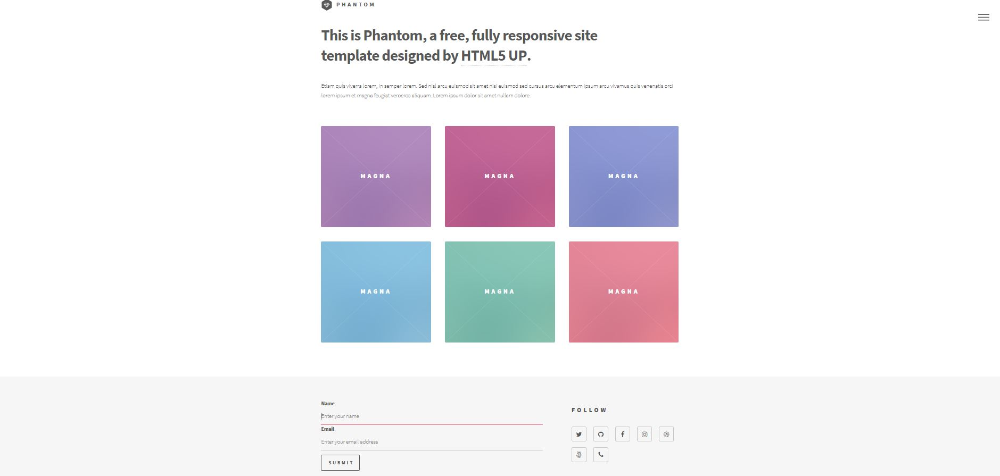

# Phantom Theme

The **Phantom** [Grav CMS](http://github.com/getgrav/grav) Theme.  
Based on the responsive [Phantom template ](https://html5up.net/phantom)  




### Supported Page Templates
* Default view template `default.md`
* Error view template `error.md`
* generic view template `generic.md`

### default.md instructions  
Default.md is intended to be your landing page.

Default.md YAML header cheatcheat:

| YAML 			 |REQUIRED		| INFO
|----------------|--------------|--------------|
|title			 |required      |Page title. Also represented in the menu.
|content		 |required      |Used to load your tiles. (generic pages)
|links			 |not required  |Used to add following links in the footer. The link name has to be a font-awesome recognized icon. 
|body_classes	 |not required|These classes will be added to the body tag. Incase you want to override the template.
|form			 |not required| Will render the form in the footer


<details><summary>default.md example</summary>


```python
---
title: Home
links:
        -
            name: twitter
            url: twitter.com
           
        -
            name: github
            url: https://github.com/youraccount
          
        -
            name: facebook
            url: facebook.com
            
        -
            name: instagram
            url: instagram.com
            
        -
            name: dribbble
            url: dribble.com

        -
            name: 500px
            url: url.com

        -
            name: phone
            url: url.com
        


            
body_classes: title-center title-h1h2
content:
    items: '@self.children'
    

form:
    action: /your-modular-page
    name: my-nice-form
    fields:
        -
            name: name
            label: Name
            placeholder: 'Enter your name'
            autofocus: 'on'
            autocomplete: 'on'
            type: text
            default: 
               
        -
            name: email
            label: Email
            placeholder: Enter your email address
            type: email
            validate:
            required: true

    buttons:
        -
            type: submit
            value: Submit
    
---


# This is Phantom, a free, fully responsive site </br> template designed by <a href="http://html5up.net">HTML5 UP</a>.


Etiam quis viverra lorem, in semper lorem. Sed nisl arcu euismod sit amet nisi euismod sed cursus arcu elementum ipsum arcu vivamus quis venenatis orci lorem ipsum et magna feugiat veroeros aliquam. Lorem ipsum dolor sit amet nullam dolore.

```
</details>


## generic.md instructions

generic.md is intended to be used as a information/blog page. Clicking a tile on the default page will open the generic page.  
generic.md  YAML header cheatcheat:

| YAML 			 |REQUIRED		| INFO
|----------------|--------------|--------------|
|title			 |required      | Page title. Also represented in the menu.
|image			 |required      | The name of the image. This image will be used in the homepage as a tile.
|style|required  |The style should either be a number between 0 and 6, or the 'random' string. Depending on the number a different colour of tile will be generated in the default page. Random will generate a random colour.  

<details><summary>generic.md example</summary>


```python
---
title: blogpost1
image: pic.jpg 
style: 1


---

# This is Phantom, a free, fully responsive site </br> template designed by <a href="http://html5up.net">HTML5 UP</a>.


Etiam quis viverra lorem, in semper lorem. Sed nisl arcu euismod sit amet nisi euismod sed cursus arcu elementum ipsum arcu vivamus quis venenatis orci lorem ipsum et magna feugiat veroeros aliquam. Lorem ipsum dolor sit amet nullam dolore.


```
</details>
